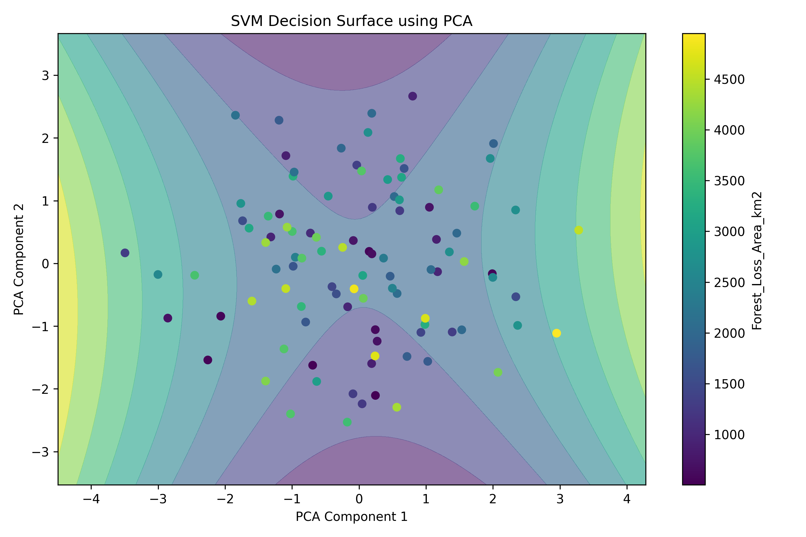

# 🌳 Deforestation Issue Analysis Using Support Vector Machine (SVM)

## 🧠 Predicting Deforestation Levels Using Machine Learning and Environmental Indicators 

---

## 👤 Author

**Sagnik Patra**

---

## 📌 Project Overview

This project develops a complete **Deforestation Issue Analysis System** using **Support Vector Machine (SVM) Regression** to predict deforestation levels across different countries and years.

The system analyzes environmental, economic, demographic, and governance-related factors that contribute to deforestation and identifies the most influential drivers of forest loss.

Using the dataset `deforestation_dataset.csv`, the project performs:

- Data preprocessing and cleaning
- Missing value handling
- Categorical feature encoding
- Feature scaling and normalization
- SVM model development
- Hyperparameter tuning using GridSearchCV
- Cross-validation
- Feature importance analysis
- Deforestation prediction
- Visualization and reporting

The project automatically generates reports, graphs, trained models, prediction files, and configuration files to support environmental research and policy-making.

---



---

## 🎯 Objectives

- Analyze deforestation trends across countries
- Predict forest loss using SVM Regression
- Identify key drivers of deforestation
- Evaluate multiple SVM kernels
- Optimize model performance through hyperparameter tuning
- Generate actionable environmental insights
- Visualize relationships between environmental and economic factors
- Support sustainable forest management policies

---

# 📂 Dataset

### Dataset Used

**deforestation_dataset.csv**

The dataset contains historical deforestation-related indicators including:

- Country
- Year
- Tree Cover Loss Percentage
- Forest Loss Area (km²)
- CO2 Emissions
- Rainfall
- Population
- GDP
- Agricultural Land Percentage
- Corruption Index
- Deforestation Policy Strictness
- Protected Areas Percentage
- International Aid
- Illegal Lumbering Incidents
- Other environmental indicators

---

# ⚙️ Project Workflow

## Phase 1: Data Preprocessing

### Data Loading

- Load CSV dataset
- Inspect dataset structure
- Validate columns and data types

### Data Cleaning

- Remove duplicate records
- Detect missing values
- Impute numerical values using Mean Imputation
- Impute categorical values using Mode Imputation

### Feature Encoding

Categorical features are converted into numerical format using:

- Label Encoding

Examples:

- Country
- Deforestation Policy Strictness
- Corruption Index Category

### Feature Scaling

Numerical variables are standardized using:

- StandardScaler

Examples:

- Population
- GDP
- CO2 Emission
- Rainfall
- Agricultural Land Percentage

---

## Phase 2: SVM Model Development

### Train-Test Split

Dataset is divided into:

- Training Data → 80%
- Testing Data → 20%

Random state ensures reproducibility.

---

### Initial Linear SVM Model

A baseline model is created using:

```python
SVR(kernel='linear')
```

The model learns relationships between environmental indicators and deforestation levels.

---

### Hyperparameter Optimization

Grid Search Cross Validation is applied to identify optimal parameters.

Parameters tuned:

- Kernel Type
- C
- Gamma
- Degree

Kernels evaluated:

- Linear
- RBF
- Polynomial

---

### Cross Validation

5-Fold Cross Validation is performed to ensure:

- Stability
- Generalization
- Robustness

---

## Phase 3: Model Evaluation

Performance metrics include:

### Mean Absolute Error (MAE)

Measures average prediction error.

### Mean Squared Error (MSE)

Measures squared prediction error.

### Root Mean Squared Error (RMSE)

Provides error in original target units.

### R-Squared (R²)

Measures overall model performance.

---

# 📊 Generated Outputs

## Data Files

### Missing Values Report

```text
svm_missing_values.csv
```

### Cleaned Dataset

```text
svm_cleaned_dataset.csv
```

### Dataset Summary

```text
svm_dataset_summary.csv
```

---

## Model Files

### Best Tuned SVM Model

```text
svm_best_svm_model.pkl
```

### Linear SVM Model

```text
svm_linear_svm_model.pkl
```

### Label Encoders

```text
svm_label_encoders.pkl
```

---

## Configuration Files

### JSON Summary

```text
svm_summary.json
```

### YAML Configuration

```text
svm_config.yaml
```

---

## Result Files

### Predictions

```text
svm_predictions.csv
```

### Feature Importance

```text
svm_feature_importance.csv
```

### Model Metrics

```text
svm_model_metrics.csv
```

### Cross Validation Results

```text
svm_cross_validation_scores.csv
```

### Grid Search Results

```text
svm_grid_search_results.csv
```

---

# 📈 Generated Visualizations

## Correlation Heatmap

```text
svm_correlation_heatmap.png
```

Visualizes relationships among all variables.

---

## Feature Importance Graph

```text
svm_feature_importance_graph.png
```

Shows the most influential drivers of deforestation.

---

## Actual vs Predicted Graph

```text
svm_actual_vs_predicted.png
```

Compares model predictions against actual values.

---

## Prediction Error Graph

```text
svm_prediction_error_graph.png
```

Shows prediction deviations.

---

## Model Comparison Graph

```text
svm_model_comparison_graph.png
```

Compares baseline and optimized SVM performance.

---

## PCA Decision Surface Visualization

```text
svm_svm_decision_surface_pca.png
```

Provides a visual representation of the SVM prediction surface after PCA dimensionality reduction.

---

# 🔍 Feature Importance Analysis

The project performs permutation-based feature importance analysis to identify critical drivers of deforestation.

Typical influential factors include:

- Population Growth
- GDP
- CO2 Emissions
- Agricultural Expansion
- Rainfall
- Illegal Lumbering Incidents
- Corruption Index
- Policy Strictness
- Protected Areas Percentage

---

# 🌍 Interpretation of Results

## Population

Rapid population growth increases demand for:

- Housing
- Infrastructure
- Agriculture

This often leads to forest clearing.

---

## GDP

Economic growth can influence deforestation through:

- Industrial expansion
- Mining
- Urbanization

However, wealthier nations may invest more in conservation.

---

## Policy Strictness

Strong environmental policies help:

- Reduce illegal logging
- Protect biodiversity
- Improve forest governance

---

## Corruption

High corruption levels may weaken:

- Environmental enforcement
- Forest monitoring
- Sustainable resource management

---

## Illegal Lumbering

One of the strongest direct indicators of forest degradation.

---

## Protected Areas

Increasing protected forest coverage significantly reduces deforestation risk.

---

# 🌱 Recommendations

Based on model findings:

### Strengthen Forest Protection Laws

Improve legal frameworks and enforcement mechanisms.

### Combat Illegal Logging

Deploy monitoring systems and stricter penalties.

### Expand Protected Forest Areas

Increase conservation zones.

### Improve Governance

Reduce corruption in forestry management.

### Promote Sustainable Agriculture

Reduce pressure on forests through modern agricultural practices.

### Invest in Reforestation

Support large-scale tree plantation initiatives.

### International Collaboration

Utilize international environmental aid effectively.

---

# 🏆 Technologies Used

## Programming Language

- Python 3.x

## Data Analysis

- Pandas
- NumPy

## Machine Learning

- Scikit-Learn

## Models

- Support Vector Regression (SVR)

## Hyperparameter Tuning

- GridSearchCV

## Visualization

- Matplotlib

## Model Storage

- Joblib

## Configuration Management

- JSON
- YAML

---

# 📊 Expected Outcomes

The system enables:

- Accurate prediction of deforestation levels
- Identification of critical environmental risks
- Evidence-based policymaking
- Sustainable forest management planning
- Environmental impact assessment
- Long-term conservation strategy development

---

# 📜 Conclusion

The **Deforestation Issue Analysis Using Support Vector Machine (SVM)** project demonstrates how machine learning can be applied to environmental sustainability challenges.

By combining environmental, economic, and governance indicators with advanced SVM modeling techniques, the system provides valuable insights into the causes of deforestation and supports informed decision-making for forest conservation and sustainable development.

---
